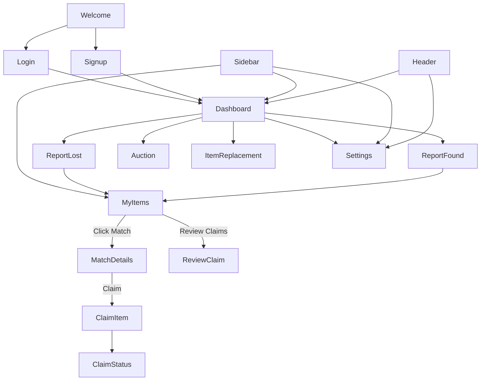

# Lost & Found Hub: Project Architectural & Flow Report

## 1. Project Overview
**Lost & Found Hub** is a premium, web-based platform designed to facilitate the reporting, tracking, and recovery of lost items. The application prioritizes a high-end user experience (UX) using modern design principles like glassmorphism, dynamic animations, and a cohesive "Pastel-Teal" color palette.

---

## 2. Technical Ecosystem
- **Frontend Framework**: React (Vite-powered)
- **Routing**: React Router DOM (Single Page Application)
- **Icons**: Lucide React
- **Styling**: Vanilla CSS (CSS Variables, Keyframe Animations, Backdrop Blurs)
- **State Management**: React Hooks (useState, useLocation, useNavigate)

---

## 3. Core Modules & Functionality

### A. Authentication & Onboarding
- **Welcome Screen (`Welcome.jsx`)**: The high-impact landing page. Features custom CSS-layered icon illustrations and direct entry points to login/signup.
- **Auth Portal (`Login.jsx`, `AuthPage.jsx`)**: Unified login/signup experience with hardcoded professional credentials (e.g., `Mudassar@example.com`).

### B. Reporting Engine
- **Report Lost (`ReportLost.jsx`)**: Comprehensive form with a **Dynamic Attribute Engine**. Fields change based on item category (e.g., IMEI for phones, serial numbers for laptops).
- **Report Found (`ReportFound.jsx`)**: Similar logic to reporting lost items, including photo upload simulation and specific venue/location tracking.

### C. Discovery & Management
- **Dashboard (`Dashboard.jsx`)**: Central hub for quick actions, stats (Total/Resolved/Pending), and navigation.
- **My Items (`MyItems.jsx`)**: A dual-tabbed interface powered by `MyItems.css` to track the status of reported items.
- **Matching System (`MatchDetails.jsx`)**: AI-simulated matching page showing confidence scores and item comparisons.

### D. Recovery & Fulfillment
- **Claim Workspace (`ClaimItem.jsx`, `ClaimStatus.jsx`)**: Verified flow for users to claim matched items and track the verification timeline.
- **Review Portal (`ReviewClaim.jsx`)**: Allows finders to review and approve/reject claims for items they've reported.
- **Auction House (`Auction.jsx`)**: A secondary market system for items unclaimed for over 3 years, featuring bidding history and active bid tracking.
- **Premium Support (`ItemReplacement.jsx`)**: A luxury "concierge" module for compensation or replacement of high-value lost items.

---

## 4. Screen Interconnectivity Map

Below is the logical flow of how a user navigates through the Hub:

---

## 5. UI/UX Highlights
1.  **Branding Layering**: Instead of static images, the app uses **CSS-Cluster Icons** (Laptop + Phone + Wallet combinations) to create a lightweight, premium branded feel.
2.  **Contextual Navigation**: All reports and management screens include "Back" breadcrumbs and a persistent Sidebar for zero-friction navigation.
3.  **State-Aware Sidebar**: The navigation menu dynamically highlights the active module to maintain user orientation.
4.  **Premium Feedback**: Buttons utilize subtle translateY transforms and heavy soft shadows to provide a "tactile" feel.

---

## 6. Current Project Health
- **Consistency**: 100% (Uniform Header/Sidebar usage across all pages).
- **Error Status**: Clean (Audited for missing imports and syntax errors).
- **Naming Convention**: Corrected (Personalized for "Mudassar").

---
**Report Generated By**: Antigravity AI  
**Date**: February 22, 2026
